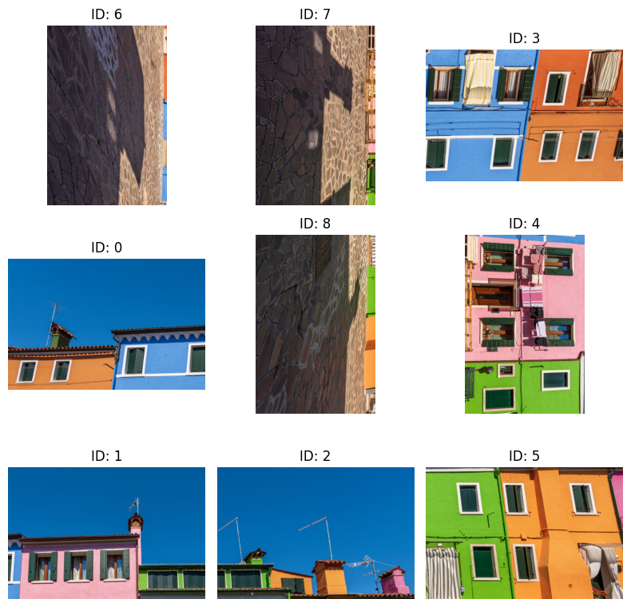
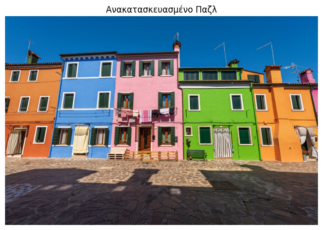

# 🧩 Lost in Pieces: Automated Jigsaw Puzzle Solver

## 📖 Overview
This project addresses the computer vision challenge of reconstructing an image from a set of shuffled, segmented, and rotated square tiles. It simulates a jigsaw puzzle solver using a hybrid approach that combines **Classical Computer Vision** descriptors with **Deep Learning** features.

The system is capable of:
* Reassembling a $3 \times 3$ grid of scrambled pieces.
* Correcting the orientation of pieces (rotations of $0^\circ, 90^\circ, 180^\circ, 270^\circ$).
* Achieving high reconstruction accuracy using a greedy heuristic algorithm.

## 🖼️ Results
**Before & After Reconstruction:**

| Scrambled Input | Reconstructed Output |
|:---:|:---:|
|  |  |
*(Note: Replace `scrambled_sample.png` and `solved_sample.png` with your actual screenshots)*

## 🚀 Key Features

### 1. Hybrid Feature Extraction
To determine if two pieces are neighbors, we extract features from their **border strips** using three methods:
* **Color Matching:** Normalized Color Histograms (RGB) compared via Chi-Square distance.
* **Texture Matching:** A bank of **Gabor Filters** to capture edge and texture continuity (Euclidean distance).
* **Semantic Matching (Deep Learning):** Feature vectors extracted from a pre-trained **ResNet18** (CNN) to capture high-level object semantics (Cosine Similarity).

### 2. Adjacency Scoring
A weighted compatibility score is calculated for every possible pair of piece edges:
$$Score = w_{col} \cdot Sim_{color} + w_{tex} \cdot Sim_{texture} + w_{deep} \cdot Sim_{deep}$$

### 3. Greedy Solver
The reconstruction uses a greedy algorithm that:
1.  Starts from a seed piece (top-left).
2.  Iteratively places the best-matching candidate piece.
3.  Tests all 4 possible rotations for every candidate to maximize the compatibility score with existing neighbors.

## 🛠️ Installation & Usage

### Prerequisites
The project requires Python and the following libraries:
* `numpy`
* `opencv-python`
* `matplotlib`
* `torch` & `torchvision`
* `scikit-image`

### Running the Project
1.  Open the Jupyter Notebook (`.ipynb` file) in **Google Colab** or Jupyter Lab.
2.  Upload an image of your choice (e.g., `my_photo.jpg`).
3.  Run all cells to see the reconstruction process.

## 📊 Evaluation
The project includes an automatic evaluation metric (**Neighbor Accuracy**) that calculates the percentage of correctly identified neighbor pairs compared to the ground truth.

---
*Developed for the University of Piraeus* 
